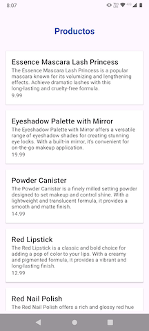
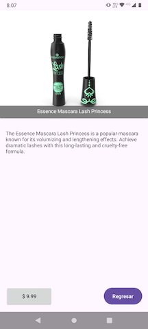
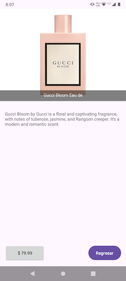

# App de productos
Esta aplicación es una lista de tareas simple desarrollada con Android utilizando las mejores prácticas de MVVM, Hilt para la inyección de dependencias

[](https://shields.io/)
[](https://shields.io/)

## Indicaciones a seguir
Un título “Productos” en negritas y con tamaño de fuente de 24 pixeles. Este título estará centrado horizontalmente y con márgenes verticales de 24 píxeles. El color del texto en hexadecimal es #0A4AA3
Una lista que deberá contener los productos retornados por el Api https://dummyjson.com/products

Vista contenedora:
La vista contenedora de cada producto tendrá márgenes de 16 píxeles.
La vista contenedora tendrá un borde de color #0A4AA3.

Esta vista deberá tener 3 campos de texto.
El primer campo de texto será para el título del producto con el siguiente formato “Nombre: valor” y deberá tener el márgen de arriba de 16 píxeles, un margen de debajo de 8 píxeles y márgenes horizontales de 16px.

El segundo campo de texto tendrá la descripción del producto con margenes verticales de 8 píxeles y horizontales de 16 pixeles.

El tercer campo de texto tendrá el precio del producto con el formato “Precio: valor” y tendrá un margen superior de 8 píxeles, un margen de inferior de 16 píxeles y margenes horizontales de 16 píxeles.

Vista del producto:
Al oprimir un producto en la vista principal, se tendrá que abrir una nueva pantalla con los datos del producto y las siguientes características:

Un título con márgenes verticales de 24 píxeles y centrado horizontalmente.

Una imagen que se cargara desde la url que tenemos en el atributo “thumbnail”. Esta imagen tendrá un margen horizontal de 16 píxeles y márgenes verticales de 24 píxeles.

Una descripción con márgenes horizontales de 16 píxeles y verticales de 24 píxeles.

Un precio centrado horizontalmente, un margen superior de 24 píxeles y un margen inferior de al menos 32 píxeles.

Un botón con el título de “Cerrar” con altura de 50 píxeles, con un margen superior de al menos 32 píxeles, un margen inferior de 24 píxeles y márgenes horizontales de 35 píxeles. El botón tendrá un borde de color #0A4AA3.

El botón cerrará la vista del producto cuando se presione y la aplicación regresará a la vista principal.

## Instrucciones para Ejecutar

1. Clona el repositorio:
    ```
    git clone https://github.com/aovazquez/testAxo.git
    ```

2. Abre el proyecto en Android Studio.

3. Sincroniza las dependencias de Gradle.

4. Ejecuta la aplicación en un emulador o dispositivo físico.

## Arquitectura

- **MVVM**: Para separar claramente las responsabilidades de UI y lógica de negocio.
- **Hilt**: Para la inyección de dependencias y mejorar la escalabilidad.
- **Retrofit**: Para obtener datos del lado del servidor
- **Glide**: Para la carga de imagenes de manera asincronica

## Decisiones de Diseño

- Se utiliza Kotlin como lenguaje de desarrollo para Android.

## Screen Shots
 
 
 

## Developer

> ### Mobile Developer
> ##### [Angel Vazquez] (aovazquez4037@gmail.com)